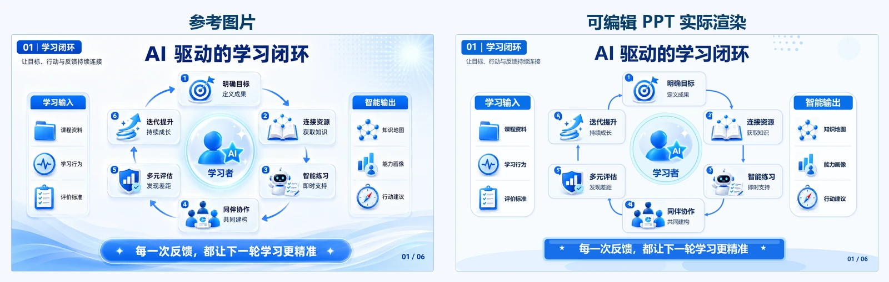
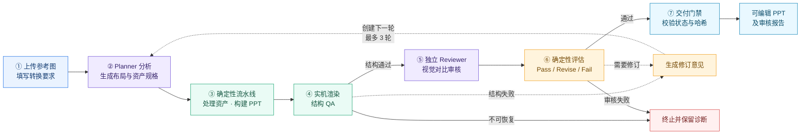

# Image to Editable PPT

[](LICENSE)

把一张参考图片重建为真正可编辑的 PowerPoint：标题和正文仍是文本框，卡片、线条和箭头仍是原生形状，复杂图标与插画则作为独立、安全的图片资产保留。

它不是简单地把整张图片铺到幻灯片上，而是帮助 Agent 分析页面结构、选择正确的重建方式、生成 PPTX、渲染预览，并验证文字与对象是否真的可编辑。

## 效果预览

[](docs/assets/readme/ai-learning-loop/ai-learning-loop-rendered.png)

左侧是[原创参考图片](docs/assets/readme/ai-learning-loop/ai-learning-loop-source.png)，右侧是生成的[可编辑 PowerPoint 实际渲染结果](docs/assets/readme/ai-learning-loop/ai-learning-loop-rendered.png)。标题、说明、编号和结论均为原生文本，卡片、面板和闭环贝塞尔曲线为原生 PowerPoint 对象；13 个具有渐变、阴影和立体细节的图标则从原图独立裁切。整个页面没有使用整页截图，也没有把含正文的卡片栅格化。

- 111 / 111 个规格元素成功构建
- 32 / 32 个必需文本为原生文本
- 可编辑文字比例 100%
- 缺失对象、字体违规、媒体缺失和越界对象均为 0
- 通过 Microsoft PowerPoint 实机渲染与结构 QA

> 视觉相似不等于整页栅格化。这个示例中的文字、卡片、面板、编号和基础连接线仍可在 PowerPoint 中逐个编辑。

## 能做什么

- 从 PNG、JPEG 等参考图重建单页可编辑 PPT。
- 精确转录中英文标题、正文、标签和页码。
- 使用原生 PowerPoint 文本、形状、线条和箭头还原主体结构。
- 对 Logo、精细图标、人物和复杂插画进行独立裁切，避免用粗糙字符或简单多边形代替。
- 清洗 SVG，校验图片哈希、尺寸、类型和文字豁免。
- 审计字体，渲染预览，并检查缺失对象、越界、栅格化正文和媒体关系。
- 支持最多三轮的视觉审核、修订和安全交付。
- Planner 与 Reviewer 采用独立上下文，避免“自己生成、自己放宽验收”。

## 快速安装

把下面这句话直接发给 Codex 或其他能够安装本地 Skill、运行 Python 和 Node.js 的 Agent：

> 请从 https://github.com/yjm110517/visual-to-editable-ppt-skill 安装 `image-to-editable-ppt` Skill，自动安装其 Python 与 Node.js 依赖，并运行 Skill 校验。

安装完成后可以直接说：

> 使用 `$image-to-editable-ppt`，把我上传的图片重建为可编辑 PPT；复杂图标优先从原图独立裁切，文字、卡片、线条和箭头保持原生可编辑。

最新的预打包版本也可以从 [GitHub Releases](https://github.com/yjm110517/visual-to-editable-ppt-skill/releases/latest) 下载。

## 第一次使用

1. 上传一张清晰的参考图片。
2. 说明页面比例、字体偏好或“按原图处理”。
3. Agent 分析页面并生成布局、裁切和资产规格。
4. 流水线构建 PPTX、渲染预览并执行结构 QA。
5. 独立 Reviewer 必须逐项检查连接关系、箭头端点、比例、裁图边界、背景接缝、视觉层次和字体层级。
6. 如有明显偏差，Planner 根据问题清单修订下一轮；结构 QA 与视觉审核都通过后才交付。

默认排版交互模式为 `ask`：缺失时一次性询问标题字体、标题字号、正文字体和正文字号。如果你说“直接做”“按原图”或“不要问”，则按原图推断。

## 项目结构

```text
visual-to-editable-ppt-skill/
├─ README.md
├─ LICENSE
├─ NOTICE
└─ image-to-editable-ppt/
   ├─ SKILL.md                 # Skill 入口与工作流
   ├─ LICENSE / NOTICE         # 随安装包分发的许可证与归属声明
   ├─ agents/                  # Planner / Reviewer 角色与提示词
   ├─ references/              # 分类、构建、审核和交付契约
   ├─ schemas/                 # 运行时 JSON Schema
   └─ scripts/                 # 资产、PPT、渲染、QA 与交付脚本
```

公开仓库除 README 演示素材外，只包含安装和运行 Skill 所需的内容。工程测试、资格评估、历史规格和发布审计工具保存在独立的私有验证仓库，不会随 Skill 安装。

## 工作原理



确定性脚本负责路径、Schema、哈希、资产安全、PPT 构建、渲染和结构 QA；多模态 Agent 负责理解参考图、规划版式和视觉审核。这样的职责分离让结果既能接近原图，也能被机器检查。

独立 Reviewer 会重点检查内容准确性、关键比例、连接拓扑、箭头端点、字体层级、裁图边界、背景接缝和视觉层次。结构 QA 通过只代表页面可以进入视觉审核，不代表已经可以交付。

## 什么时候裁图，什么时候重画

这是还原质量最关键的判断：

- **原生 PPT**：标题、正文、卡片、分隔线、普通箭头、基础几何图形。
- **从原图独立裁切**：Logo、人物、精细图标、带高光或复杂渐变的小型插画。
- **安全 SVG**：轮廓清晰、无嵌入文字、适合缩放或换色的图标。
- **局部背景图片**：复杂纹理、光效和波纹，但不得把正文一起栅格化。

Skill 明确禁止用 Unicode 字符或粗糙多边形冒充精细图标，也禁止用整页截图、整卡片截图或整表截图绕过可编辑性要求。

## 交付内容

通过交付门禁后，输出目录包含：

```text
<name>_editable.pptx
<name>_assets.zip
<name>_preview.png
<name>_qa_report.json
<name>_review_report.json
<name>_review_evaluation.json
<name>_delivery_decision.json
```

PPTX 是主要交付物；其余文件用于说明资产来源、结构完整性、视觉审核结果和最终接受轮次。

## 可编辑性与安全

- 要求可编辑的文字必须构建为原生文本对象。
- 图片只能通过已验证的 `asset_id` 引用，构建器不接受任意路径。
- SVG 拒绝脚本、外链、事件属性、远程资源和嵌入文字。
- 每个规格元素都有稳定对象 ID，可与 PPTX 中的实际对象逐项对账。
- 文件写入采用 staging 与原子提交，失败不会留下半成品。
- 日志、源图、Agent 私有调用记录和临时文件不会进入最终交付目录。

## 运行环境

基础运行需要：

- Python 3.10 或更高版本
- Node.js 20 或更高版本
- `image-to-editable-ppt/scripts/requirements.txt` 中的 Python 依赖
- `image-to-editable-ppt/scripts/package.json` 中的 Node.js 依赖

严格的 PowerPoint 渲染和结构验收需要 Windows 与 Microsoft PowerPoint。LibreOffice 可以作为回退渲染器，但不是基础安装的硬性要求。

依赖安装和环境探测可以交给宿主 Agent 自动完成；普通使用者不需要理解仓库中的每个脚本。

## 当前范围

当前版本聚焦于高质量单页重建，支持 `text`、`shape`、`line` 和 `image` 四类元素。多页母版推断、图表、表格对象、原生分组和复杂自由路径不属于当前稳定范围；密集表格会使用原生矩形、分隔线和文本框重建。

## 许可证

本项目的源码、Schema、Prompt 和项目文档采用 [Apache License 2.0](LICENSE) 发布，版权归 `yjm110517` 及相应贡献者所有。

Apache-2.0 允许商业使用、修改、分发和私有使用，并提供明确的贡献者专利授权。分发修改版本时，请保留 `LICENSE` 与 [NOTICE](NOTICE)，并标明所作修改。

项目许可证不会自动授予对以下内容的权利：

- 用户上传的图片、Logo、字体或其他素材；
- 第三方资产及依赖；
- 基于用户素材生成的演示文稿内容。

这些内容继续适用其各自的版权、商标和许可证要求。发布包不捆绑 `node_modules` 或 Python 第三方包，安装得到的依赖仍遵循各自许可证。

## 开始使用

- 阅读 [Skill 入口](image-to-editable-ppt/SKILL.md)
- 查看 [元素分类规则](image-to-editable-ppt/references/element-classification.md)
- 查看 [PPT 构建契约](image-to-editable-ppt/references/ppt-build-contract.md)
- 查看 [渲染与结构 QA](image-to-editable-ppt/references/rendering-and-qa.md)
- 从 [最新 Release](https://github.com/yjm110517/visual-to-editable-ppt-skill/releases/latest) 下载安装包
- 查看 [Apache-2.0 许可证](LICENSE)

如果你发现某类页面、图标或字体处理得不理想，欢迎提交 Issue，并附上可公开的参考图、渲染结果和期望行为。
